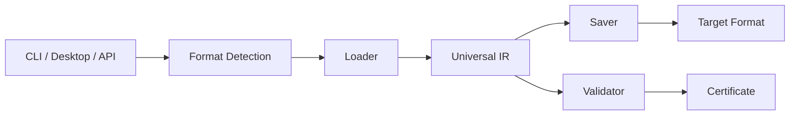
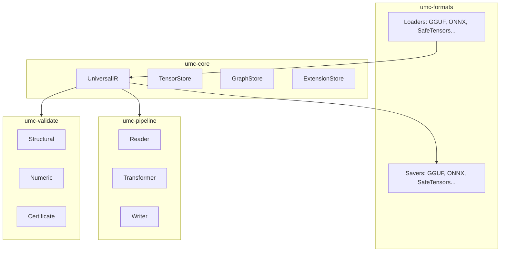

<div align="center">

# UMC — Universal Model Converter

**Convert AI models between formats. Fast. Lossless. Verifiable.**

UMC is an open-source model conversion platform written in Rust. It converts
models between 12 formats (GGUF, ONNX, SafeTensors, PyTorch, TFLite, AWQ,
GPTQ, LoRA, CoreML, ExecuTorch, OpenVINO, TensorRT) through a single
**Universal Intermediate Representation (IR)** — no Python, no GIL, no
runtime overhead.

---

[](https://github.com/rustnew/UMC/actions)
[](LICENSE)
[](https://www.rust-lang.org/)
[](https://www.rust-lang.org/)
[](https://github.com/rustnew/UMC)

[**Quick Start**](#quick-start) · [**Formats**](#supported-formats) · [**CLI**](#cli-reference) · [**API**](#api-reference) · [**Docs**](docs/README.md)

</div>

---

## Why UMC?

Production AI is fragmented: training frameworks, inference engines, edge
runtimes and cloud servers each use their own model format. Converting
between them usually means juggling incompatible Python tools — with silent
quality loss and no way to prove the result is correct.

UMC replaces that with **one binary**:

```bash
$ umc convert model.gguf model.onnx
✅ Detected : GGUF v3 → ONNX
✅ Converted: 4.2s
✅ Validated: structural + numeric checks passed
```

## Key Features

- **12 formats** — GGUF, ONNX, SafeTensors, PyTorch, TFLite, AWQ, GPTQ, LoRA
  (native) + CoreML, ExecuTorch, OpenVINO, TensorRT (external tooling).
- **Universal IR** — a single intermediate representation; converting A→B
  is always `load(A) → IR → save(B)`, never a fragile A→B converter.
- **Automatic format detection** — 13 detectors using magic bytes, headers
  and content analysis (GGUF, GGML, TFLite, HDF5, ONNX, PyTorch,
  SentencePiece, AWQ, GPTQ, LoRA, SafeTensors, Diffusers).
- **Conversion path finding** — `umc path` computes the optimal multi-hop
  route when no direct conversion exists.
- **Verifiable conversions** — structural validation (topology, shapes) and
  numeric validation (per-tensor divergence, dtype-aware thresholds);
  F32 round-trips are **bit-identical** (asserted by tests).
- **Memory-mapped I/O** — models are streamed, never fully loaded in RAM.
- **Parallel pipeline** — reader / transformer / writer pipeline with
  rayon data-parallel tensor processing.
- **REST API** — production-ready Actix-Web server with auth (JWT),
  async conversion jobs and SSE progress.
- **Desktop app** — native cross-platform GUI (egui/eframe) for local
  drag-and-drop conversions.

---

## Quick Start

### Install

```bash
# From source
git clone https://github.com/rustnew/UMC.git
cd UMC
cargo build --release -p umc-cli
./target/release/umc --help
```

### Desktop app (interface native)

UMC ships a native desktop application (no web server, no browser) built
with egui/eframe — drag-and-drop conversions, format auto-detection,
progress bar, cancellation, history and settings, all local:

```bash
cargo run -p umc-desktop
```

```bash
# Or build a standalone binary
cargo build --release -p umc-desktop
./target/release/umc-desktop
```

### Convert a model

```bash
# Basic conversion (format auto-detected)
umc convert model.gguf model.onnx

# Force source / target formats
umc convert model.bin model.safetensors --from gguf --to safetensors

# Choose output dtype
umc convert model.gguf model.onnx --dtype f16

# Validation: none | structural | numeric | strict (default: structural)
umc convert model.gguf model.onnx --validate strict

# Metadata-only (skip tensor data)
umc convert model.gguf model.onnx --metadata-only
```

### Inspect a model

```bash
umc inspect model.gguf
umc inspect model.gguf --output json
```

### List formats & find paths

```bash
umc formats
umc path gguf onnx
```

---

## Supported Formats

| Format | Load | Save | Notes |
|--------|:----:|:----:|-------|
| **GGUF** | ✅ | ✅ | llama.cpp, Ollama, LM Studio |
| **ONNX** | ✅ | ✅ | Universal inference format |
| **SafeTensors** | ✅ | ✅ | HuggingFace standard |
| **PyTorch** | ✅ | ✅ | `.pt`, `.pth`, `.bin` |
| **TFLite** | ✅ | ✅ | Mobile & embedded |
| **AWQ** | ✅ | ✅ | 4-bit quantization |
| **GPTQ** | ✅ | ✅ | 4-bit quantization |
| **LoRA** | ✅ | ✅ | Fine-tuning adapters |
| **CoreML** | — | ✅ | Apple Silicon (external tooling) |
| **ExecuTorch** | — | ✅ | On-device AI (external tooling) |
| **OpenVINO** | — | ✅ | Intel CPU/GPU/VPU (external tooling) |
| **TensorRT** | — | ✅ | NVIDIA GPU (external tooling) |

*External formats are exported by invoking the vendor toolchain
(`coremltools`, `executorch`, `openvino`, `trtexec`).*

---

## CLI Reference

```
umc convert <INPUT> <OUTPUT> [OPTIONS]
umc inspect <FILE> [OPTIONS]
umc formats
umc path <FROM> <TO>
```

| Command | Description |
|---------|-------------|
| `convert` | Convert a model between formats (auto-detection, `--from`/`--to` to force) |
| `inspect` | Print model metadata and tensor info (`--output json` for JSON) |
| `formats` | List all supported formats |
| `path` | Find the conversion path between two formats |

---

## API Reference

The REST API (`umc-api`, Actix-Web + SQLx/Postgres) listens on port `8080`
by default.

```bash
cargo run -p umc-api
```

### Endpoints

| Method | Path | Description |
|--------|------|-------------|
| GET | `/health` | Liveness probe |
| GET | `/ready` | Readiness probe |
| POST | `/auth/register` | Create an account |
| POST | `/auth/login` | Log in (JWT) |
| POST | `/auth/refresh` | Refresh token |
| POST | `/auth/logout` | Log out |
| GET | `/auth/me` | Current user |
| GET | `/formats` | List supported formats |
| GET | `/formats/graph` | Conversion graph |
| POST | `/upload` | Upload a model file |
| POST | `/jobs` | Create a conversion job |
| GET | `/jobs` | List jobs |
| GET | `/jobs/{id}` | Job status |
| DELETE | `/jobs/{id}` | Cancel a job |
| GET | `/jobs/{id}/download` | Download result |
| GET | `/jobs/{id}/progress` | Progress (SSE) |

---

## Architecture





**Design principles:**

1. **Rust everywhere** — no Python runtime, no GIL.
2. **mmap by default** — models are never fully loaded in RAM.
3. **Parallel pipeline** — reader / transformer / writer run concurrently.
4. **Universal IR** — `N+M` loaders/savers instead of `N×M` converters.
5. **Verifiable** — every conversion can be structurally and numerically validated.

---

## Repository Layout

| Directory | Description |
|-----------|-------------|
| `crates/umc-core` | Universal IR, tensor/graph/extension stores, traits |
| `crates/umc-detect` | Format detection (13 detectors) |
| `crates/umc-graph` | Conversion graph & path finding |
| `crates/umc-pipeline` | Reader/Transformer/Writer pipeline, mmap, parallelism |
| `crates/umc-validate` | Structural, numeric validation & certificates |
| `crates/umc-formats` | Format loaders/savers |
| `crates/umc-cli` | CLI binary |
| `crates/umc-tests` | Integration & round-trip test suite |
| `umc-api` | REST API (Actix-Web + SQLx/Postgres) |
| `umc-desktop` | Desktop app (egui/eframe, cross-platform) |

---

## Development

```bash
# Build the whole workspace
cargo build --workspace

# Run all tests
cargo test --workspace

# Lint & format
cargo clippy --workspace
cargo fmt --check

# Run the CLI
cargo run -p umc-cli -- --help

# Run the API (needs PostgreSQL)
cargo run -p umc-api

# Run the desktop app
cargo run -p umc-desktop
```

### Testing

The test suite covers:

- **Round-trip fidelity** — GGUF → SafeTensors → GGUF with structural and
  numeric validation (F32 must be bit-identical).
- **Format integration** — GGUF, ONNX, SafeTensors loaders/savers.
- **Pipeline** — reader/transformer/writer behavior.
- **Compliance & channels** — API-level checks.

---

## Roadmap

| Status | Item |
|--------|------|
| ✅ Done | Core IR, 8 native formats, CLI, validation, API |
| 🚧 Next | More native formats (Diffusers, GGML, SentencePiece) |
| 🚧 Next | Quantization (Q4_K_M, FP8, INT8) |
| 🚧 Next | Conversion certificates (ed25519) |
| 💡 Planned | GitHub Action, SDKs, model hub |

---

## Contributing

Contributions are welcome! See [CONTRIBUTING.md](CONTRIBUTING.md) for
guidelines, and the [Code of Conduct](CODE_OF_CONDUCT.md).

- 🐛 [Issues](https://github.com/rustnew/UMC/issues)
- 💡 [Discussions](https://github.com/rustnew/UMC/discussions)
- 📖 [Documentation](docs/README.md)

---

## License

UMC is licensed under [Apache 2.0](LICENSE).

---

<div align="center">

**UMC — The ffmpeg of AI models.**

[⭐ Star us on GitHub](https://github.com/rustnew/UMC) · [📖 Read the Docs](docs/README.md)

</div>