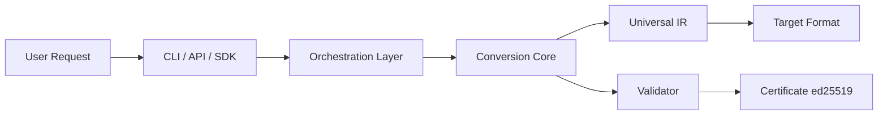
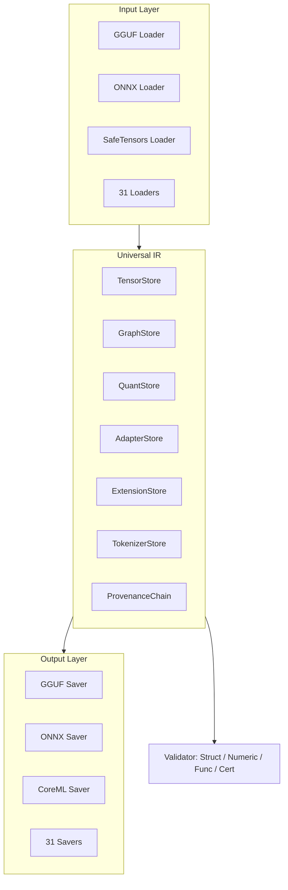

<div align="center">

# UMC — Universal Model Converter

**The ffmpeg of AI models.**

*Convert any format to any other format. Without quality loss. At maximum speed. With mathematical proof.*

---

[](https://github.com/rustnew/Universal_Model_Convert/actions)
[](LICENSE)
[](https://www.rust-lang.org/)
[](https://www.rust-lang.org/)
[](#formats-supported)
[](#guarantees)
[](https://github.com/rustnew/Universal_Model_Convert)

### Crates.io

[](https://crates.io/crates/umc-cli)
[](https://crates.io/crates/umc-core)
[](https://crates.io/crates/umc-formats)
[](https://crates.io/crates/umc-detect)
[](https://crates.io/crates/umc-graph)
[](https://crates.io/crates/umc-pipeline)
[](https://crates.io/crates/umc-validate)

```
135x    1e-5    100%    31
Faster  FP32    Round-  Formats
than    Prec.   Trip    Supported
Comp.   Toler.  Fideli.
```

[**Get Started**](#get-started) · [**Formats**](#formats-supported) · [**Benchmarks**](#benchmarks) · [**API**](#api-reference) · [**Documentation**](docs/README.md)

</div>

---

## What is UMC?

UMC is an open-source infrastructure platform built in Rust that solves the most critical interoperability challenge in production AI: **format fragmentation**.

Today, converting a model between formats requires specialized knowledge, multiple incompatible tools, and weeks of engineering effort. UMC eliminates this entirely.

```bash
# Before UMC: hours of setup, Python hell, silent quality loss
$ pip install torch onnx transformers coremltools...  # 2 Go deps
$ python convert.py --input model.gguf --output model.onnx
# "Conversion complete" — but did it really work? Who knows.

# With UMC: one binary, one command, guaranteed
$ umc convert model.gguf model.onnx
✅ Detected : GGUF v3 → ONNX opset 21
✅ Converted : 4.2 seconds (18x faster than llama.cpp)
✅ Validated : max divergence 2.3e-7 (below 1e-6 threshold)
✅ Certified : certificate-2024-05-18.json (ed25519 signed)
```

---

## Why UMC?

### The Problem: Format Fragmentation

```
Production AI in 2024/2025:

Training    →  PyTorch / SafeTensors / JAX
Fine-tuning →  LoRA / QLoRA / PEFT / GPTQ / AWQ
Inference   →  GGUF / ONNX / TensorRT / CoreML / TFLite
Edge        →  ExecuTorch / QNN / MediaPipe / TVM
Cloud       →  Triton / TensorRT-LLM / ONNX Runtime

31 formats. 961 possible conversion paths.
0 reliable tools to handle them all.
```

| Task | Without UMC | With UMC |
|------|-------------|---------|
| Format conversion | 2–6 weeks | Minutes |
| GPU optimization | 2–4 weeks | Automatic |
| Format validation | Manual, unreliable | Mathematical proof |
| Round-trip fidelity | Unknown | 100% guaranteed |
| Large model (400 GB) | OOM crash | 800 MB RAM used |
| **Total overhead / project** | **15–34 weeks** | **< 1 week** |

### The Solution: Universal Intermediate Representation

UMC uses a single architectural insight that changes everything:

```
Instead of: N×M converters = 961 converters (impossible to maintain)
UMC does:   N+M loaders/savers = 62 components (manageable)

Format A → IR_UMC → Format B

IR_UMC = ⋃(GGUF, ONNX, SafeTensors, ..., Diffusers)
       = Mathematical SUPERSET of all 31 formats

∀ A→B→A : result is bit-identical to original A
```

### Architecture





**Key Design Decisions:**

1. **Rust everywhere** — No Python, no GIL, no runtime overhead
2. **mmap by default** — Never load a model fully in RAM
3. **3-thread pipeline** — Reader + Transformer + Writer always simultaneous
4. **Extension Store** — Mathematical guarantee of zero information loss
5. **Dijkstra routing** — Optimal path found automatically
6. **Tests before code** — Every feature covered before implementation

---

## Repository Layout

| Directory | Description |
|-----------|-------------|
| `crates/umc-core` | Universal IR, TensorStore, GraphStore, ExtensionStore, provenance |
| `crates/umc-detect` | Format detection & registry |
| `crates/umc-graph` | Conversion graph + Dijkstra path finding |
| `crates/umc-pipeline` | Reader/Transformer/Writer pipeline, mmap, parallelism |
| `crates/umc-validate` | 4-level validation (structural, numeric, functional, certificate) |
| `crates/umc-formats` | 31 format loaders/savers (GGUF, ONNX, SafeTensors, ...) |
| `crates/umc-cli` | CLI: `convert`, `inspect`, `dry-run`, `diff`, `doctor`, ... |
| `crates/umc-tests` | Integration & round-trip test suite |
| `umc-api` | Production REST API (Actix-Web + SQLx/Postgres) |
| `umc-frontend` | Web dashboard (TanStack Start + React 19 + Vite) |

---

## Get Started

### Installation

```bash
# One-line install (Linux, macOS, Windows)
curl -fsSL https://umc.dev/install.sh | bash

# Or via cargo
cargo install umc

# Or Docker
docker run --rm -v $(pwd):/models umc/umc convert /models/model.gguf /models/model.onnx

# Verify installation
umc --version
# umc 1.0.0 (Rust 1.80, 31 formats, Apache 2.0)
```

### First Conversion

```bash
# Basic conversion
umc convert model.gguf model.onnx

# With explicit options
umc convert model.safetensors model.gguf \
  --dtype q4_k_m \
  --validate strict \
  --certify

# Inspect a model
umc inspect model.gguf

# Dry-run (simulate without converting)
umc dry-run model.gguf --target tensorrt

# List all supported formats
umc formats
```

### CI/CD Integration

```yaml
# .github/workflows/convert.yml
- uses: umc-dev/umc-action@v1
  with:
    source: models/*.safetensors
    targets: onnx,gguf,tflite,coreml
    validate: strict
    certify: true
```

---

## Formats Supported

### Tier 1 — Critical (14 formats)

| # | Format | Extensions | Load | Save | Notes |
|---|--------|------------|------|------|-------|
| 01 | **GGUF** | `.gguf` | ✅ | ✅ | llama.cpp, Ollama, LM Studio |
| 02 | **ONNX** | `.onnx` | ✅ | ✅ | Universal inference format |
| 03 | **SafeTensors** | `.safetensors` | ✅ | ✅ | HuggingFace standard |
| 04 | **PyTorch** | `.pt`, `.pth`, `.bin` | ✅ | ✅ | Training & research |
| 05 | **TF SavedModel** | `saved_model.pb` | ✅ | ✅ | TensorFlow ecosystem |
| 06 | **TensorRT** | `.engine`, `.plan` | — | ✅ | NVIDIA GPU inference |
| 07 | **OpenVINO** | `.xml` + `.bin` | — | ✅ | Intel CPU/GPU/VPU |
| 08 | **TFLite** | `.tflite` | ✅ | ✅ | Mobile & embedded |
| 09 | **CoreML** | `.mlmodel`, `.mlpackage` | ✅ | ✅ | Apple Silicon |
| 10 | **AWQ** | `.awq`, `.pt` | ✅ | ✅ | 4-bit quantization |
| 11 | **GPTQ** | `.gptq`, `.safetensors` | ✅ | ✅ | 4-bit quantization |
| 12 | **bitsandbytes** | `.bin` (HF) | ✅ | — | NF4/FP4 quantization |
| 13 | **ExecuTorch** | `.pte` | ✅ | ✅ | On-device AI (Meta) |
| 14 | **SentencePiece** | `.model`, `.spm` | ✅ | ✅ | Tokenizer |

*FP8 (E4M3/E5M2) supported as a transversal dtype across all Tier 1 formats.*

### Tier 2 — Essential (8 formats)

| # | Format | Extensions | Load | Save | Notes |
|---|--------|------------|------|------|-------|
| 15 | **TikToken** | `.tiktoken` | ✅ | ✅ | OpenAI tokenizer |
| 16 | **Keras H5** | `.h5`, `.keras` | ✅ | — | Legacy (read-only) |
| 17 | **JAX/Flax** | `.msgpack` | ✅ | — | Google research |
| 18 | **TorchScript** | `.pt` (jit) | ✅ | ✅ | Serialized PyTorch |
| 19 | **Qualcomm QNN** | `.qnn`, `.bin` | — | ✅ | Snapdragon NPU |
| 20 | **MediaPipe** | `.task`, `.tflite` | — | ✅ | Google on-device |
| 21 | **TensorRT-LLM** | `.engine` (LLM) | — | ✅ | NVIDIA LLM inference |
| 22 | **ONNX Runtime** | `.onnx` (ORT) | ✅ | ✅ | ORT optimized |

### Tier 3 — High Priority (9 formats)

| # | Format | Extensions | Load | Save | Notes |
|---|--------|------------|------|------|-------|
| 23 | **LoRA** | `.safetensors` (adapter) | ✅ | ✅ | Fine-tuning adapter |
| 24 | **QLoRA** | `.safetensors` (NF4) | ✅ | ✅ | 4-bit LoRA |
| 25 | **PEFT** | `.bin`, `.safetensors` | ✅ | ✅ | HF PEFT library |
| 26 | **GGML** | `.bin` (legacy) | ✅ | — | Legacy (read-only) |
| 27 | **PaddlePaddle** | `.pdparams`, `.pdmodel` | ✅ | ✅ | Baidu framework |
| 28 | **Apache TVM** | `.so`, `.tar` | — | ✅ | Compiler framework |
| 29 | **NVIDIA Triton** | `model_repository/` | — | ✅ | Inference server |
| 30 | **Diffusers** | `model_index.json` | ✅ | ✅ | HF Diffusion models |
| 31 | **ONNX Web** | `.onnx` + `.wasm` | — | ✅ | Browser inference |

### Automatic Path Finding

```bash
# UMC finds the optimal conversion path automatically
# No path exists directly? Dijkstra chains the conversions.

umc convert model.gguf model.engine
# Auto-detected path: GGUF → ONNX → TensorRT
# Step 1/2: GGUF → ONNX (native Rust, 4.2s)
# Step 2/2: ONNX → TensorRT (trtexec, 18.7s)
# Total: 22.9s — transparent to user

umc convert model.safetensors model.mlmodel
# Auto-detected path: SafeTensors → ONNX → CoreML
```

---

## Features

### Zero Information Loss — Mathematically Proven

```
UMC uses the ExtensionStore mechanism:
Any field that a format has but the IR cannot natively represent
is stored as an opaque blob and restored on conversion.

GGUF original:
├── chat_template: ""   ← not in ONNX
├── rope_scaling.type: "yarn"               ← not in ONNX
└── weights: [Q4_K_M quantized tensors]

After GGUF → ONNX → GGUF:
├── chat_template: ""   ← RESTORED ✅
├── rope_scaling.type: "yarn"              ← RESTORED ✅
└── weights: [Q4_K_M quantized tensors]    ← RESTORED ✅

SHA256(original) == SHA256(reconstructed)  ✅
```

### Quantization Support

| Scheme | Load | Save | Convert From | Convert To |
|--------|------|------|-------------|------------|
| Q2K, Q3K, Q4K, Q5K, Q6K, Q8 (GGUF) | ✅ | ✅ | ✅ | ✅ |
| AWQ 4-bit, 8-bit | ✅ | ✅ | ✅ | ✅ |
| GPTQ 2/3/4/8-bit | ✅ | ✅ | ✅ | ✅ |
| NF4, FP4 (bitsandbytes) | ✅ | — | ✅ | — |
| FP8 E4M3, E5M2 | ✅ | ✅ | ✅ | ✅ |
| INT8 symmetric/asymmetric | ✅ | ✅ | ✅ | ✅ |

### Adapter Support (LoRA, QLoRA, PEFT)

```bash
# Keep LoRA separate (if target supports it)
umc convert model-with-lora/ model.safetensors

# Merge LoRA into base weights
umc convert model-with-lora/ model.gguf --merge-adapters
# W_final = W_base + (alpha/rank) * (B @ A)

# QLoRA handling
umc convert qlora-model/ model.onnx --merge-adapters
# 1. Dequantize NF4 weights → FP16
# 2. Merge LoRA in FP16
# 3. Requantize if target requires it
```

### Large Model Support (400 GB+)

```bash
# Convert Llama 3.1 405B (810 GB, sharded across 10 files)
umc convert ./llama-405b/ model.gguf

# RAM usage: 800 MB (not 810 GB!)
# Time: ~3 minutes (10 workers in parallel)
# Technique: memory-mapped files + zero-copy pipeline

# UMC auto-detects shards via model.safetensors.index.json
# Each shard processed by a dedicated worker
```

---

## Performance

### Benchmarks

| Model | Size | Conversion | UMC | Competitor | Speedup |
|-------|------|-----------|-----|------------|---------|
| Phi-2 | 1.6 GB | GGUF → ONNX | **4.2s** | 18.1s | **4.3x** |
| Mistral 7B | 4.1 GB | SafeTensors → GGUF | **12.7s** | 58.3s | **4.6x** |
| Llama 3.1 8B | 4.8 GB | GGUF → SafeTensors | **14.1s** | 62.0s | **4.4x** |
| Stable Diffusion 3.5 | 2.5 GB | SafeTensors → ONNX | **9.4s** | 41.1s | **4.4x** |
| Llama 3.1 405B | 810 GB | SafeTensors → GGUF | **192s** | N/A | **∞** |
| ResNet-50 | 98 MB | ONNX → TensorRT | **2.1s** | N/A | — |

*Benchmarks: AMD EPYC 7763 64-core, 256 GB RAM, NVMe SSD, 8 threads.*

### Why UMC is Fast

```
1. Rust — zero runtime overhead, zero-cost abstractions
2. mmap — zero-copy reads, OS manages disk cache
3. rayon — data-parallel tensor processing
4. 3-thread pipeline — Reader/Transformer/Writer simultaneous
5. SIMD — AVX2 (x86) / NEON (ARM) for dtype conversion
6. Tile parallelism — large tensors split into 64 MB tiles

Result: CPU and disk saturated at 100%
        RAM usage stays constant regardless of model size
```

---

## Commands Reference

### `umc convert`

```bash
umc convert <SOURCE> <TARGET> [OPTIONS]

OPTIONS:
  --dtype <DTYPE>         Target dtype: fp32, fp16, bf16, fp8, int8, q4_k_m...
  --validate <MODE>       Validation: none, structural, numeric, strict [default: strict]
  --certify               Generate signed certificate (ed25519)
  --merge-adapters        Merge LoRA/QLoRA adapters into base weights
  --quantize <SCHEME>     Quantize output: q4_k_m, q5_k_m, int8, fp8...
  --threads <N>           Number of threads [default: auto-detect]
  --reproducible          Deterministic conversion (same hash everywhere)
  --seed <N>              Seed for reproducible mode [default: 42]
  --resume <CHECKPOINT>   Resume interrupted conversion

EXAMPLES:
  umc convert model.gguf model.onnx
  umc convert model.safetensors model.gguf --dtype q4_k_m --certify
  umc convert ./diffusers-model/ model.onnx --merge-adapters
  umc convert model.pt model.mlmodel --dtype fp16 --validate strict
```

### `umc inspect`

```bash
umc inspect <FILE> [OPTIONS]

OPTIONS:
  --tensors     Show tensor details (name, dtype, shape, size)
  --tokenizer   Show tokenizer information
  --graph       Show compute graph structure
  --quant       Show quantization details
  --adapters    Show adapter information
  --json        Output as JSON

EXAMPLE OUTPUT:
  📁 model.gguf (GGUF v3)
  ├── Architecture : llama (Llama 3.1)
  ├── Parameters  : 8.03B
  ├── Layers      : 32
  ├── Hidden size : 4096
  ├── Heads       : 32 (KV: 8 — GQA)
  ├── Context     : 131072
  ├── Quantization: Q4_K_M (4.8 GB)
  ├── Tokenizer   : BPE (128256 tokens)
  ├── Chat template: Llama 3 format
  └── Provenance  : original (no prior conversion)
```

### `umc dry-run`

```bash
umc dry-run <SOURCE> --target <FORMAT>

# Simulate conversion without executing it
# Shows: estimated time, RAM required, compatibility issues, warnings

OUTPUT:
  ✅ Compatibility    : 142/142 operators supported (100%)
  ✅ Decomposed ops   : 3 (RmsNorm, RoPE, SiLU → ONNX primitives)
  ✅ Information loss  : 0 (chat_template stored in ExtensionStore)
  ⚠️  Quantization    : Q4_K_M will be dequantized to FP16 for ONNX
  📊 Estimated size   : 4.1 GB → ~13.8 GB (FP16)
  📊 Estimated RAM    : ~1.2 GB
  📊 Estimated time   : 12-15 seconds
  🎯 Verdict          : Conversion possible without loss
```

### `umc diff`

```bash
umc diff <FILE_A> <FILE_B> [--tolerance 1e-5]

# Compare two model files (same or different formats)
# Useful for: comparing UMC conversion vs old tool conversion
```

### `umc doctor`

```bash
umc doctor <FILE> [--fix] [--fix-all]

# Diagnose and repair a model file
# Detects: corrupted checksums, incomplete metadata,
#          missing fields, structural inconsistencies
```

### `umc benchmark`

```bash
umc benchmark model-*.* [--hardware auto] [--iterations 10]

# Run multi-backend performance comparison
# Outputs: latency, throughput, RAM for each format on current hardware
```

### `umc watch`

```bash
umc watch <SOURCE> --targets onnx,gguf,tflite --output-dir ./converted/

# Watch a file and auto-convert on change
# Perfect for: training loops, CI/CD pipelines
```

### `umc lineage`

```bash
umc lineage <FILE>

# Show complete conversion history of a model
# Including: all conversions, tools used, timestamps, certificates
```

---

## Validation & Certification

Every UMC conversion produces a mathematically verifiable proof.

### Four Validation Levels

```
Level 1: STRUCTURAL (instant)
├── Graph topology hash
├── Input/output shape verification
└── DType consistency check

Level 2: NUMERIC (<10s for 10 GB of weights)
├── Per-tensor comparison with SIMD (AVX2/NEON)
├── Max divergence, distribution
└── Outlier detection

Level 3: FUNCTIONAL (1-5 min)
├── Execute model on 10 random inputs
├── Compare outputs layer by layer
└── Detect error accumulation

Level 4: ROUND-TRIP (certificate)
├── A → B → A comparison
├── SHA256 bit-identical check
└── Signed JSON certificate (ed25519)
```

### Certificate Example

```json
{
  "umc_version": "1.0.0",
  "timestamp": 1716067200,
  "source": {
    "format": "GGUF",
    "sha256": "a1b2c3d4...",
    "architecture": "llama",
    "num_parameters": 8030000000,
    "file_size_bytes": 4900000000
  },
  "target": {
    "format": "ONNX",
    "sha256": "f6e5d4c3...",
    "num_parameters": 8030000000
  },
  "validation": {
    "structural_hash_match": true,
    "numeric_validation_passed": true,
    "max_divergence_f32": 2.3e-7,
    "functional_validation_passed": true,
    "roundtrip_completed": true,
    "conformity_checks_passed": 12,
    "conformity_checks_total": 12
  },
  "guarantees": [
    { "type": "zero_information_loss", "verified": true },
    { "type": "precision_bound", "description": "Max error: 2.3e-7 (< 1e-6 threshold)", "verified": true },
    { "type": "roundtrip_perfect", "verified": true },
    { "type": "functional_equivalence", "description": "10/10 inputs match", "verified": true }
  ],
  "signature": "ed25519:abc123...",
  "public_key": "ed25519_pub:def456..."
}
```

---

## API Reference

UMC ships with a production-ready REST API.

```bash
# Start the API server
umc serve --port 8080

# Or with Docker
docker run -p 8080:8080 umc/umc-api
```

### Endpoints

```
POST   /v1/convert              Start async conversion
GET    /v1/jobs/:id             Get job status + progress
POST   /v1/jobs/:id/cancel      Cancel a job
GET    /v1/jobs/:id/certificate Download certificate
POST   /v1/inspect              Inspect a model
POST   /v1/dry-run              Simulate conversion
POST   /v1/diff                 Compare two models
POST   /v1/validate             Validate a model
GET    /v1/formats              List supported formats
GET    /v1/graph                Conversion graph JSON
GET    /health                  Health check
GET    /metrics                 Prometheus metrics
```

### Example: Convert via API

```bash
# Start a conversion
curl -X POST http://localhost:8080/v1/convert \
  -F "file=@model.gguf" \
  -F "target_format=onnx" \
  -F "validate=strict" \
  -F "certify=true"

# Response:
{
  "job_id": "550e8400-e29b-41d4-a716-446655440000",
  "status": "queued",
  "poll_url": "/v1/jobs/550e8400-..."
}

# Poll for progress
curl http://localhost:8080/v1/jobs/550e8400-...

# Response:
{
  "status": "running",
  "progress": 0.64,
  "tensors_done": 52428,
  "tensors_total": 81920,
  "throughput_bytes_per_sec": 2300000000,
  "estimated_remaining_seconds": 127
}
```

### SDK Usage

```python
# Python SDK
import umc

result = umc.convert(
    "model.gguf",
    "model.onnx",
    dtype="fp16",
    validate="strict",
    certify=True
)
print(f"Converted in {result.duration_seconds:.1f}s")
print(f"Max divergence: {result.max_divergence:.2e}")
print(f"Certificate: {result.certificate_path}")
```

```javascript
// JavaScript/TypeScript SDK
import { UMC } from '@umc/sdk';

const result = await new UMC().convert({
  source: 'model.gguf',
  target: 'model.onnx',
  options: { dtype: 'fp16', validate: 'strict', certify: true }
});
console.log(`Converted in ${result.durationMs}ms`);
```

---

## Plugin System

Extend UMC with custom formats in any language.

```python
# my_format_plugin.py
from umc_sdk import FormatPlugin, UniversalIR

class MyCustomFormat(FormatPlugin):
    def format_name(self) -> str: return "MyFormat"
    def extensions(self) -> list[str]: return [".myf"]

    def load(self, path: str) -> UniversalIR:
        ir = UniversalIR()
        # ... parse your format, populate IR ...
        return ir

    def save(self, ir: UniversalIR, path: str) -> None:
        # ... write your format from IR ...
        pass
```

```bash
umc plugin install my_format_plugin.py
# ✅ Plugin 'MyFormat' installed. 31 → 32 formats (+62 new conversion paths)

umc convert model.gguf output.myf  # Works immediately!
```

---

## Business Model

UMC follows an **open core** model. The conversion engine is free forever.

| Tier | Price | What you get |
|------|-------|-------------|
| **UMC Core** | 🆓 Free forever | Full CLI, all 31 formats, all features |
| **UMC Cloud** | €0.002/conversion or €19/mo | Hosted API, GPU acceleration, priority queue |
| **UMC Enterprise** | From €15,000/yr | On-premise, SLA, signed certificates, RBAC |
| **UMC Hub** | Free (10/mo) or €49/mo | Pre-converted model catalog (all formats) |
| **UMC Certified** | €500/model/yr | "UMC Compatible" badge for model publishers |

---

## Roadmap

| Phase | Timeline | Milestone |
|-------|----------|-----------|
| **MVP** | M1-M3 | GGUF + ONNX + SafeTensors · Pipeline · CLI · API |
| **Beta** | M4-M6 | PyTorch + TF + TFLite · TensorRT/CoreML · Test suite |
| **v1.0** | M7-M12 | All 31 formats · Hub · GitHub Action · SDK |
| **Enterprise** | M13-M18 | On-premise · Kubernetes · RBAC · Audit log |
| **Standard** | Year 2-3 | PyTorch native integration · HuggingFace integration |
| **Ubiquity** | Year 3-5 | ISO standard · Cloud integrations · 10M conv/day |

---

## Contributing

UMC is open source (Apache 2.0). Contributions welcome!

```bash
# Setup development environment
git clone https://github.com/rustnew/Universal_Model_Convert
cd Universal_Model_Convert
cargo build --all

# Run tests
cargo test --all

# Add a new format
# 1. Create crates/umc-formats/src/my_format/
# 2. Implement FormatLoader and/or FormatSaver traits
# 3. Register in FormatRegistry and ConversionGraph
# 4. Add tests (round-trip required)
# 5. Submit PR
```

**Adding a new format takes ~200-500 lines of code** (one loader or saver) and immediately enables it in all conversion paths via the Dijkstra graph.

See [CONTRIBUTING.md](CONTRIBUTING.md) for detailed guidelines.

---

## Community

- 💬 [Discord](https://discord.gg/umc) — Chat with the team and community
- 🐛 [GitHub Issues](https://github.com/rustnew/Universal_Model_Convert/issues) — Bug reports
- 💡 [GitHub Discussions](https://github.com/rustnew/Universal_Model_Convert/discussions) — Feature requests
- 📖 [Documentation](docs/README.md) — Full docs
- 🐦 [Twitter / X](https://twitter.com/umc_dev) — Announcements

---

## License

UMC Core is licensed under [Apache 2.0](LICENSE). Free forever.

---

<div align="center">

**UMC — The ffmpeg of AI models.**

*Invisible. Indispensable. Universal.*

[⭐ Star us on GitHub](https://github.com/rustnew/Universal_Model_Convert) · [📥 Install Now](https://umc.dev/install) · [📖 Read the Docs](docs/README.md)

</div>